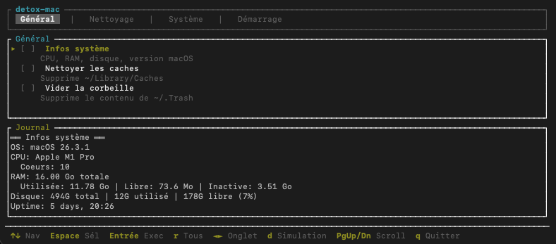

# detox-mac



> A fast, cute and clean Rust-based macOS maintenance CLI tool.  
> Think of it as *CleanMyMac*, but open-source, modular, and no BS. 🦀

---

## ✨ Features

- 🧹 Clean system & user caches
- 🗑️ Empty trash bins
- 🧨 Remove LaunchAgents & Login Items
- 📦 List or remove background processes
- 🔁 Flush DNS cache
- 🔍 Reindex Spotlight
- 🧠 Free up purgeable space
- 🛠️ Repair disk permissions

---

## 🚀 Installation

```bash
git clone https://github.com/youruser/detox-mac.git
cd detox-mac
cargo build --release
cp target/release/detox-mac /usr/local/bin/detox-mac
```

You’ll find the binary at target/release/detox-mac

---

## 🔧 Usage

`detox-mac <command>`

Available commands:
```
Command	Description
clean-cache	Clean macOS system and user caches
clean-trash	Empty user trash
remove-launch-items	Delete background launch agents/daemons
list-login-items	List login items and background services
remove-login-item <str>	Remove login/background item by name
flush-dns	Flush DNS cache
free-space	Free purgeable storage (local snapshots)
reindex-spotlight	Reset Spotlight index
repair-permissions	Reset disk permissions (user scope)
```

---

## 🛡️ Sudo?

Some operations require elevated privileges (like DNS flush or LaunchDaemons removal).
Run with sudo when needed:
```
sudo detox-mac flush-dns
```

---

## ❤️ Why?

Because we love our Macs, but we don’t love bloated cleanup apps.