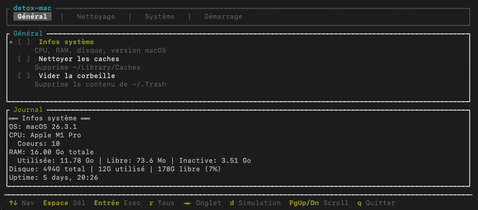

# detox-mac



> A fast, cute and clean Rust-based macOS maintenance TUI tool.
> Think of it as *CleanMyMac*, but open-source, modular, and no BS. 🦀

---

## ✨ Features

### 🧹 Nettoyage
- Nettoyer les caches utilisateur (`~/Library/Caches`)
- Vider la corbeille (`~/.Trash`) ou toutes les corbeilles (volumes montés inclus)
- Nettoyer les logs (`~/Library/Logs`)
- Supprimer les fichiers `.DS_Store` récursivement
- Nettoyer le cache Homebrew (`brew cleanup --prune=all`)
- Nettoyer les données Xcode (DerivedData, DeviceSupport, Simulateurs)

### 💻 Système
- Afficher les infos système (CPU, RAM, disque, version macOS, uptime)
- Vérifier les mises à jour macOS (`softwareupdate -l`)
- Lister les apps les plus volumineuses (`/Applications`)
- Détecter les gros fichiers (> 500 Mo dans `~`)
- Flush DNS (`dscacheutil` + `mDNSResponder`)
- Libérer l'espace disque (snapshots Time Machine)
- Réindexer Spotlight (`mdutil -E`)
- Purger la RAM inactive (`purge`)

### 🚀 Démarrage
- Vue détaillée des LaunchAgents/Daemons (label, statut actif/inactif, tag Apple/Tiers)
- Lister uniquement les agents tiers (non-Apple)
- Désactiver/réactiver les agents tiers sans les supprimer (`launchctl unload/load`)
- Supprimer les LaunchAgents utilisateur (avec `launchctl unload` avant suppression)
- Supprimer tous les LaunchAgents/Daemons

### 🛡️ Sécurité & UX
- **Mode Simulation (dry-run)** : voir ce qui serait fait sans rien modifier
- **Confirmation** avant chaque tâche destructive
- **Dashboard au démarrage** : résumé système + espace récupérable (caches, corbeille, logs) + nombre d'agents
- Affichage de la taille avant/après chaque opération de nettoyage

---

## 🚀 Installation

```bash
git clone https://github.com/youruser/detox-mac.git
cd detox-mac
cargo build --release
cp target/release/detox-mac /usr/local/bin/detox-mac
```

---

## 🔧 Utilisation

Lancez simplement :

```bash
detox-mac
```

L'application s'ouvre en mode TUI interactif avec 4 onglets.

### Raccourcis clavier

| Touche | Action |
|---|---|
| `↑` `↓` / `j` `k` | Naviguer dans les tâches |
| `←` `→` / `Tab` | Changer d'onglet |
| `Entrée` | Exécuter la tâche sélectionnée |
| `Espace` | Cocher/décocher pour exécution groupée |
| `r` | Lancer toutes les tâches cochées |
| `d` | Activer/désactiver le mode simulation |
| `PgUp` / `PgDn` | Scroller le journal |
| `Esc` | Annuler la confirmation / Quitter |
| `q` | Quitter |

### Onglets

| Onglet | Description |
|---|---|
| **Général** | Tâches d'optimisation rapide (caches, corbeille, logs, DNS...) |
| **Nettoyage** | Nettoyage détaillé (Homebrew, Xcode, toutes corbeilles...) |
| **Système** | Infos, mises à jour, scan d'apps/fichiers, DNS, Spotlight, RAM |
| **Démarrage** | Gestion des LaunchAgents/Daemons (vue, filtre, disable/enable) |

---

## 🛡️ Sudo

Certaines opérations nécessitent des privilèges élevés (flush DNS, Spotlight, purge RAM).
Lancez avec sudo si besoin :

```bash
sudo detox-mac
```

Les tâches nécessitant sudo sont marquées `[sudo]` dans l'interface.

---

## 🧪 Mode Simulation

Appuyez sur `d` pour activer le mode simulation. Dans ce mode :
- Aucun fichier n'est supprimé
- Aucune commande système n'est exécutée
- Les tailles et fichiers concernés sont affichés normalement
- Le header et le journal indiquent `[SIMULATION]`

Idéal pour voir ce que l'app ferait avant de lancer pour de vrai.

---

## 🏗️ Architecture

```
src/
├── main.rs              # Point d'entrée, boucle d'événements
├── app.rs               # État de l'app, onglets, tâches, logique
├── ui.rs                # Rendu TUI (ratatui)
└── modules/
    ├── cache.rs          # Nettoyage des caches utilisateur
    ├── trash.rs          # Vidage corbeille (simple + multi-volumes)
    ├── logs.rs           # Nettoyage des logs
    ├── dsstore.rs        # Suppression des .DS_Store
    ├── homebrew.rs       # Nettoyage cache Homebrew
    ├── xcode.rs          # Nettoyage données Xcode
    ├── system.rs         # Commandes système (DNS, Spotlight, RAM...)
    ├── sysinfo.rs        # Infos système & dashboard
    ├── scanner.rs        # Scan apps volumineuses & gros fichiers
    ├── launch.rs         # Suppression LaunchAgents/Daemons
    ├── login.rs          # Vue détaillée, filtre Apple/tiers, disable/enable
    └── utils.rs          # Utilitaires (tailles, dry-run, wrappers)
```

**Dépendances** : `ratatui`, `crossterm` — rien d'autre.

---

## ❤️ Why?

Because we love our Macs, but we don't love bloated cleanup apps.
