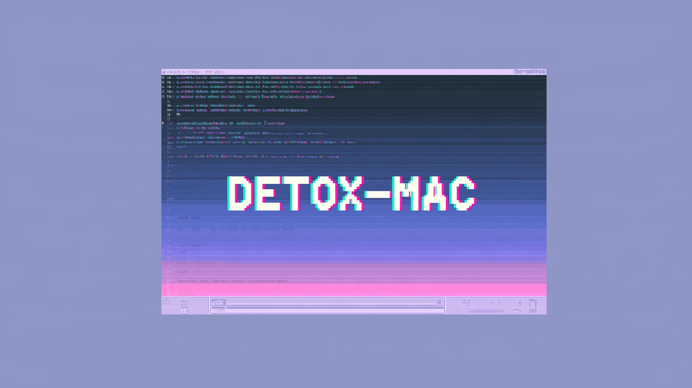

# detox-mac



> macOS maintenance from the command line, written in Rust. 🦀
> Like *CleanMyMac*, but open-source, scriptable, and no BS.

```bash
detox info          # what the machine holds, and what can be reclaimed
detox ram           # what is eating memory, grouped by application
detox files dev     # build residue sleeping in your projects
detox orphans       # what uninstalled applications left behind
detox clean all -n  # what would be deleted, touching nothing
detox clean all     # go, into the trash
detox undo          # actually, no
```

---

## ✨ Commands

| Command | Purpose |
|---|---|
| `info` | Machine summary (macOS, CPU, RAM, swap, disk, uptime), reclaimable space, startup agents |
| `scan [TARGET…]` | Measure reclaimable space, **never deleting anything** |
| `clean <TARGET…>` | Clean one or more targets (`all` for everything) |
| `apps` | Installed applications, largest first |
| `files large` | Large files under a directory |
| `files dev` | Build residue of local projects (`target`, `node_modules`…) |
| `files downloads` | Installers and archives you downloaded and never opened |
| `files clean` | Remove that residue, past a given age |
| `ram` | Processes grouped by parent application, sorted by memory |
| `inspect <target>` | Process tree of one application, with CPU, age and arguments |
| `kill <target>` | Stop every process of one application (by name or number) |
| `orphans` | Leftovers of applications that are no longer installed |
| `uninstall <app>` | Remove an application **and** everything it left behind |
| `schedule <daily\|weekly\|off>` | Run a cleanup on its own, through `launchd` |
| `history` | What was removed, when, and whether it can come back |
| `undo [ID]` | Put back what a run moved to the trash |
| `agents list\|disable\|enable\|remove` | Startup agents and daemons (`launchd`) |
| `sys dns\|spotlight\|memory\|snapshots\|simulators\|updates` | One-off system operations |
| `completions <shell>` | bash / zsh / fish / elvish / powershell completions |

### Cleaning targets

| Target | Contents | Losing it costs |
|---|---|---|
| `cache` | `~/Library/Caches` | nothing |
| `container-cache` | `Data/Library/Caches` of every sandboxed app | nothing |
| `logs` | `~/Library/Logs` | nothing |
| `ds-store` | `.DS_Store` files in the home directory | nothing |
| `homebrew` | Homebrew download cache (`brew cleanup --prune=all -s`) | nothing |
| `pkg-cache` | Global caches of npm, yarn, pnpm, bun, cargo, go, gradle, maven, pip, uv, SwiftPM, CocoaPods, composer, NuGet, pub | a download |
| `docker` | Unused containers, images and build caches — **never volumes** | a download |
| `xcode` | DerivedData, Archives, DeviceSupport (iOS/watchOS/tvOS), simulator caches | a build |
| `trash` | `~/.Trash` | your data |
| `trash-all` | `~/.Trash` plus your own trash on every mounted volume | your data |
| `simulators` | iOS simulator devices — **left out of `all`** | a download |
| `ios-backups` | Local iPhone and iPad backups — **left out of `all`** | your data |
| `vm` | Colima, Lima, Podman, VirtualBox, Vagrant, Parallels images — **left out of `all`** | your data |
| `all` | Every target above except `simulators` and `ios-backups` |  |

The last column is not decoration: `scan` sorts by it, so the free wins come
first, and it decides how many times `clean` asks before acting.

`container-cache` and `ios-backups` are invisible without Full Disk Access.
Rather than report them as empty, the tool says it cannot read them.

Docker is only cleaned when it is installed **and** the daemon answers;
otherwise the target is skipped with the reason. Same for Homebrew and Xcode.

---

## 🚀 Install

```bash
git clone https://github.com/Sn0wAlice/detox-mac.git
cd detox-mac
cargo install --path .
```

Or, without `cargo install`:

```bash
cargo build --release
sudo cp target/release/detox /usr/local/bin/
```

Requires macOS and Rust 1.85+ (2024 edition).

> The crate is `detox-mac`; the command you type is **`detox`**. Its files live
> under `~/.config/detox-mac` and `~/.local/state/detox-mac`.

---

## 🔧 Usage

### Global options

| Option | Effect |
|---|---|
| `-n`, `--dry-run` | Measure and print what would happen, change nothing |
| `-y`, `--yes` | Answer yes to every confirmation (scripts, cron) |
| `--purge` | Delete for good instead of moving to the trash |
| `-x`, `--exclude <GLOB>` | Never touch paths matching this glob (repeatable) |
| `--no-config` | Ignore the configuration file |

`scan` and `clean` also take `-o`, `--older-than <DAYS>`, which leaves alone
anything touched more recently than that. A cache an application is using
right now is not reclaimable in any useful sense.
| `-q`, `--quiet` | Print warnings and errors only |
| `--json` | JSON on stdout, for scripts |
| `--color <auto\|always\|never>` | Colour (also honours `NO_COLOR`) |

### Examples

```bash
# Quick diagnosis
detox info

# Full measurement, slow targets included (.DS_Store, Docker…)
detox scan all

# Clean only the harmless things, no confirmation
detox clean cache logs trash --yes

# The package manager caches, usually the biggest free win
detox scan pkg-cache
detox clean pkg-cache

# Protect something for the length of one command
detox clean all -x '~/Documents/archives/**'

# Leftovers of applications that are gone
detox orphans
detox orphans --clean

# What did I remove yesterday, and can I have it back?
detox history
detox undo

# The applications you never open, then remove one properly
detox apps --unused 180
detox uninstall "Screen Studio"

# Installers rotting in ~/Downloads
detox files downloads

# Have it run itself, every Sunday at 3am
detox schedule weekly -t cache logs pkg-cache

# See what a full cleanup would free
detox clean all --dry-run

# The 30 largest applications
detox apps --top 30

# Files over 2 GB in a specific directory
detox files large --min 2G --path ~/Movies

# Build residue untouched for more than a week
detox files dev
detox files clean --older-than 30

# What is holding memory, then stop it
detox ram --detail --top 5
detox inspect discord
detox kill discord

# Third-party startup agents, then disable one
detox agents list --third-party
detox agents disable com.docker.helper

# Purgeable space and updates
detox sys snapshots
detox sys updates
```

### Speed

The walk is spread over a few threads pulling from one shared pile of
directories, rather than splitting only the top level — a home directory is
never balanced, and splitting the top of it leaves most threads idle. On this
machine the `.DS_Store` sweep went from 18.6 s to 6.3 s that way.

A `clean` that follows a `scan` within ten minutes reuses the figures the scan
already paid for, entry by entry, and only re-measures what has been touched
since. That turns the second disk walk into a file read:

```
$ detox clean pkg-cache -n     # cold
0.41s
$ detox scan pkg-cache && detox clean pkg-cache -n
0.004s
```

### What the numbers mean

Sizes are the **blocks the files occupy**, not their apparent length — the same
thing `du` reports, and the same thing you get back. That matters more than it
sounds:

- a sparse file is counted for what it takes, not for the hole it declares;
- a transparently compressed file is counted compressed;
- a file reachable through several **hard links** is counted once, which is the
  difference between a plausible number and a wild one on a pnpm or npm store.

iCloud files that have been **evicted** from the disk are recognised (by the
`SF_DATALESS` flag, or the `.icloud` placeholder) and left out of every total:
they take no space here, and deleting one would remove the real file from
iCloud, on every device.

APFS **clones** are the one case that cannot be detected: two files sharing
their blocks after a copy-on-write copy each report their full size, and no
per-file API says otherwise. That is a known overstatement, not a silent one.

After a cleanup, the free space is read again and the difference printed next
to what was announced. It is the line that keeps the rest of the tool honest —
a measurement bug, a clone or purgeable space shows up here as a gap instead of
hiding behind a confident total.

A directory that cannot be read is **never counted as empty**. It is reported,
and the totals say how many were missed:

```
  Sandboxed app caches         — unreadable — grant Full Disk Access to your terminal
! 470 directories could not be read — grant Full Disk Access to your terminal
```

### Progress

Long operations draw a progress bar or a spinner **on stderr**, so stdout stays
pipeable and `--json` stays parseable:

```
Measuring ████████████░░░░░░░░░░░░ 12/24  ~/Documents/mlab.other/nav-ext
Looking for projects ⠹ 3481  ~/Downloads/card
```

It is disabled with `--quiet`, with `--json`, and whenever stderr is not a
terminal. `--color always` forces it back on.

### Shell completions

```bash
detox completions zsh > ~/.zsh/completions/_detox
```

### JSON output

Every document carries a `schema` number, bumped when a field changes meaning.

```bash
detox scan all --json | jq '.total'
detox scan all --json | jq '.targets[] | select(.risk == "cache")'
detox clean cache --json --yes | jq '{freed, trashed, disposal}'
detox orphans --json | jq '.leftovers[0]'
detox history --json | jq '.runs[] | select(.disposal == "trash") | .id'
detox files dev --json | jq '[.residue[].bytes] | add'
detox ram --json | jq '.groups[] | select(.autostart) | .name'
detox inspect spotify --json | jq '.group.processes[].args'
detox agents list --json | jq '.agents[] | select(.apple == false) | .label'
```

---

## 🧹 Build residue

`detox files dev` looks for directories the toolchain knows how to rebuild
— `target`, `node_modules`, `.gradle`, `vendor`… — and only reports those that
have not moved for a while.

```bash
detox files dev                          # untouched for 7 days
detox files dev --older-than 30          # only the really dormant ones
detox files dev --lang rust node         # one ecosystem in particular
detox files clean --older-than 30        # remove them, after confirmation
detox files clean --path ~/dev -n        # dry run on a specific directory
```

```
Build residue in ~ — untouched for 10 day(s) (58 directories, 106.40 GB)
    26.17 GB  target           ~/Documents/mlab.sh/vuln.mlab.sh         rust · 12d
    16.35 GB  target           ~/Documents/mlab.sh/news.mlab.sh         rust · 11d
     8.48 GB  target           ~/Documents/mlab.other/mlab-cloudflare   rust · 12d
```

### How a directory is recognised

**Never by its name alone.** A `target` is only picked up when it sits next to a
`Cargo.toml` (or a `pom.xml`), a `build` only when the matching project file is
there, and a CMake `build` only when it actually contains a `CMakeCache.txt`. A
lone `target` with no manifest is left alone.

| Language | Marker | Directories | `--native` command |
|---|---|---|---|
| `rust` | `Cargo.toml` | `target` | `cargo clean --offline` |
| `node` | `package.json` | `node_modules`, `.next`, `.nuxt`, `.turbo`, `.parcel-cache`, `.svelte-kit`, `.angular`, `.astro` | — |
| `python` | `pyproject.toml`, `setup.py`, `requirements.txt`, `Pipfile` | `__pycache__`, `.pytest_cache`, `.mypy_cache`, `.ruff_cache`, `.tox` | — |
| `gradle` | `build.gradle(.kts)`, `settings.gradle` | `build`, `.gradle` | `./gradlew clean --offline` |
| `maven` | `pom.xml` | `target` | `mvn -o -q clean` |
| `swift` | `Package.swift` | `.build` | `swift package clean` |
| `dotnet` | `*.csproj`, `*.fsproj`, `*.vbproj`, `*.sln` | `bin`, `obj` | `dotnet clean` |
| `php` | `composer.json` | `vendor` | — |
| `elixir` | `mix.exs` | `_build`, `deps` | `mix clean` |
| `dart` | `pubspec.yaml` | `build`, `.dart_tool` | `flutter clean` |
| `zig` | `build.zig` | `zig-cache`, `.zig-cache`, `zig-out` | — |
| `go` | `go.mod` | `vendor` | — |
| `cmake` | `CMakeLists.txt` + `CMakeCache.txt` | `build`, `cmake-build-debug`, `cmake-build-release` | — |

- **Age** is the time since the directory *or its top-level content* last
  changed: a `target` you compiled into this morning is never offered, however
  old the project is.
- Python virtualenvs (`.venv`), Docker volumes and hand-written `dist`
  directories are **not** touched: too ambiguous.
- The walk never descends into a directory already identified as regenerable,
  nor into hidden directories, `Library`, `Applications`, `Pictures`, `Movies`.

### Removal, or the language's own tool?

By default, `files clean` **removes the directory**. For `cargo` as for `npm`
the result is identical: `cargo clean` wipes `target/` entirely, and `npm` has
no clean command — removing `node_modules` *is* the official method, `npm ci`
puts it back.

`--native` hands over to the language's tool where one exists:

```bash
detox files clean --native --older-than 30
```

- The tool is only used when it is **installed** (`gradlew` is looked up in the
  project, everything else in `PATH`); otherwise the directory is removed, with
  no failure and no question.
- Commands run **offline** (`--offline`, `-o`) and non-interactively: a cleanup
  must never trigger a dependency download.
- When the tool leaves things behind — `mix clean` does not touch `deps/`,
  `dotnet clean` only removes what MSBuild tracked — the directory is removed
  afterwards and the line says `then removed the leftovers`.
- It is slower: a `gradlew clean` boots a JVM. Hence plain removal by default.

---

## 🧠 Memory

`detox ram` does what Activity Monitor does, more readably: it groups
processes **by parent application**, so an Electron app with fifteen helpers is
a single line.

```bash
detox ram                      # top 15 applications outside macOS
detox ram --detail             # with the processes of each group
detox ram --all                # include macOS and Apple applications
detox ram --min 100M --top 0   # everything above 100 MB
```

```
Memory
  Physical         16.00 GB — 9.64 GB used, 358.6 MB free, 5.37 GB inactive
  Swap             2.44 GB used of 4.00 GB
  Pressure         71% of memory free

Processes outside macOS (21 group(s) — 7.36 GB)
    1.    1.64 GB  Visual Studio Code                 14 proc.
    2.    1.60 GB  Claude                             27 proc.
    3.   796.0 MB  Spotify                            6 proc.
    4.    92.0 MB  Little Snitch                      starts at login · 1 proc.
    5.    19.0 MB  WiFiman Desktop                    starts at login · 1 proc.
```

- A process with no bundle (`node`, `rust-analyzer`, `zsh`…) is attached to the
  application that launched it — but never to a system parent, otherwise
  everything would end up under `launchd`.
- **`starts at login`** marks an application launched by a `launchd` agent:
  that is where updaters and background daemons hide. Stop one with
  `detox agents disable <label>`.
- The figure shown is the real footprint (`top`), the one Activity Monitor
  reports; `ps` is the fallback when it is unavailable.

### Understanding one application

```bash
detox inspect 2            # the 2nd group of the last detox ram
detox inspect spotify      # by name
detox inspect claude       # `claude` (CLI) and `Claude` (app) stay distinct
detox inspect spotify -s   # without command lines
```

```
Spotify
  Bundle           /Applications/Spotify.app
  Memory           855.0 MB — 6 processes
  CPU              0.7% (average since launch)

    266.0 MB  Spotify [939]                                    0.6% · 3d 0h
    ├─   339.0 MB  Spotify Helper (Renderer) [1288]            0.0% · 3d 0h
    │              --type=renderer --user-data-dir=/Users/…
    └─    20.0 MB  Spotify Helper [1248]                       0.0% · 3d 0h
                   --type=utility --utility-sub-type=storage.mojom.StorageService
```

The tree follows the real parent/child chain, and the arguments
(`--type=renderer`, `--type=gpu-process`…) say what each helper is for. When
the application is started by a `launchd` agent, its label is printed together
with the command that disables it.

The `%` is the average CPU since the process started (what `ps` reports), not an
instant sample: that is what exposes a background process grinding away.

### Stopping a whole application

The numbers in the left column are shortcuts for `kill`:

```bash
detox kill 3               # the 3rd group of the last detox ram
detox kill discord         # by name
detox kill vs code         # `vs code` finds `Visual Studio Code`
detox kill spotify --force # SIGKILL, when SIGTERM was not enough
detox kill -n discord      # dry run: lists the targeted processes
```

`kill` sends `SIGTERM` to **every** process of the group, roots first so that
helpers shut down cleanly, then checks who survived.

- A number is only a shortcut to a **name**: the target is resolved again and
  printed before the confirmation, so a ranking that moved between two commands
  can never kill the wrong application.
- An ambiguous name is never guessed: the candidates are listed.
- macOS components are refused without `--system`.
- `detox-mac` never kills itself; when the target holds the terminal running the
  command, it says so before asking.

---

## 🛡️ Safety

`detox-mac` deletes files. It is built so that never happens by surprise, and
so that a mistake is not the end of the story.

### Deletion goes to the trash

By default nothing is destroyed: entries are **moved to `~/.Trash`**, which
makes every cleanup reversible. The output says so, because "freed" would be a
lie — the blocks are still allocated until the trash is emptied:

```
  Moved to trash:  4.20 GB
  Still on disk until the trash is emptied — detox clean trash
  Changed your mind? detox undo
```

`--purge` deletes for good instead. The trash targets themselves always purge:
emptying the trash into the trash is not a thing.

Files on another volume cannot be moved to the user's trash; rather than
silently deleting them, the tool says so and points at `--purge`.

### Before it starts

Emptying the cache of a running application ranges from harmless to a corrupted
profile. The memory snapshot already knows who is running, so `clean` crosses
the two and says so:

```
! 3 running application(s) will lose their cache: Slack, Spotify, Visual Studio Code
! quit them first if you would rather not find out what that does.
```

### Asking twice

A confirmation before any destructive operation, as before — and a **second,
typed confirmation** whenever the run cannot be undone:

```
? Clean: cache? [y/N] y
! This cannot be undone — nothing goes to the trash: cache.
? Type delete forever to confirm, anything else to cancel:
```

A stray `y` cannot get through that one. The second gate is asked when
`--purge` is in effect, when a target always purges, and when a target holds
your own data rather than cache. It is skipped by `--yes` — which prints a
warning line instead — and can be turned off in the configuration.

### The journal

Every run that removes something writes a file under
`~/.local/state/detox-mac/journal`:

```bash
detox history          # what was removed, when, and whether it can come back
detox undo             # put the last run back
detox undo 20260918-230512
```

`undo` never overwrites: an original path that is occupied again is left alone
and reported, as is anything no longer in the trash.

### And still

- **Dry run** (`-n`): exact measurement of what would go, zero modification.
- **Apple agents are never disabled nor removed**, even with `--all-third-party`.
- **Docker volumes are never pruned**: they hold your data.
- **iOS simulators and iOS backups are excluded from `all`**.
- **`trash-all` only touches your own trash** on each volume, never the other
  accounts' on that machine.
- Symlinks are never followed, when walking or when deleting.

### Exclusions

Nothing matching an exclusion is removed, listed or counted — it never reaches
the confirmation in the first place:

```bash
detox clean all -x '~/Documents/archives/**' -x '**/.venv'
detox files clean -x '~/dev/current-project/**'
```

Command-line exclusions add to the configured ones; one never replaces the
other, so `-x` can only ever protect more.

---

## ⚙️ Configuration

`~/.config/detox-mac/config.toml` (or `$DETOX_MAC_CONFIG`), all optional:

```toml
# Paths that must never be touched, whatever the command.
# `*` stays inside a path segment, `**` crosses directories, a bare name
# matches any single component.
exclude = [
  "~/Documents/archives/**",
  "**/.venv",
  ".env",
]

# What a deletion does: "trash" (default) or "purge".
disposal = "trash"

# Targets used by `clean` and `scan` when none is given.
default_targets = ["cache", "logs", "pkg-cache"]

# Ask a second time before anything irreversible. Default: true.
confirm_twice = true

# Leave alone anything touched in the last N days. Default: 0 (everything).
# 30 is a good value for a scheduled run: it is what macOS itself uses to
# empty the trash.
min_age_days = 0
```

A line the parser cannot make sense of is **reported and ignored**, never
guessed at — a misspelled `disposal` leaves the safe default in place rather
than silently doing something else. `--no-config` skips the file entirely.

---

## 🧟 Leftovers

Dragging an application to the trash takes the bundle and leaves everything
else behind.

```bash
detox orphans                  # list them
detox orphans --clean          # remove them, after two confirmations
detox orphans --clean com.acme.app
```

```
Leftovers of uninstalled applications (35 — 2.2 MB)
    1.     1.3 MB  com.xamarin.fontconfig               cache
    2.     404 KB  com.nootch.Nootch                    container
    3.     252 KB  dev.grimoire.poc                     support
```

Matching is deliberately conservative, because guessing here means eating
someone's data:

- A directory is only attributed when its **name is a bundle identifier**
  (`com.acme.app`, two dots at least). A hand-named directory —
  `Application Support/Sublime Text` — is never claimed, so the list is
  **shorter than what is really there**, by design.
- An identifier related to an installed one counts as installed: helpers,
  frameworks and extensions belong to their application.
- Installed means more than `/Applications`: preference panes count, and so do
  the applications that live inside `Application Support` — updaters, embedded
  CLIs — which is what keeps Chrome's updater off the list.
- Group containers are matched under their real identifier, team prefix and
  `group.` marker removed.
- Apple identifiers are never listed.

Places searched: `Application Support`, `Containers`, `Group Containers`,
`Caches`, `Logs`, `HTTPStorages`, `WebKit`, `Preferences`,
`Saved Application State`, `Cookies`, `LaunchAgents`.

---

## 🗑️ Uninstalling

The active side of `orphans`: take the application *and* what it scattered
around.

```bash
detox uninstall "Tor Browser"
detox uninstall spotify -n          # see what would go
```

```
Tor Browser — 479.6 MB
  Identifier       org.torproject.torbrowser

    479.6 MB  application    /Applications/Tor Browser.app
        4 KB  preferences    ~/Library/Preferences/org.torproject.torbrowser.plist
```

- An exact name wins outright, so `Notes` never drags in `Notes Helper`; an
  ambiguous one is refused with the list of candidates.
- A **running** application is refused, not killed: removing it out from under
  itself leaves half a process working against files that no longer exist.
- Its `launchd` agents are unloaded before their definitions disappear.
- Everything goes to the trash like any other deletion, and `undo` puts it back.

Which application to remove is the other half of the question:

```bash
detox apps --unused 180
```

```
Applications untouched for 180 day(s) (24 — 5.51 GB)
    696.0 MB  Google Chrome Canary               never opened
    543.1 MB  Screen Studio                      never opened
    481.8 MB  Telegram Lite                      never opened
```

Size alone says which application is big. Size next to the last time it was
opened — Spotlight's `kMDItemLastUsedDate`, not the modification time — says
which one to actually remove.

---

## 📥 Downloads

The same idea, applied to the folder everything lands in:

```bash
detox files downloads                      # installers untouched for 180 days
detox files downloads --older-than 30
detox files downloads --all                # every file, not only installers
detox files downloads --clean
```

```
In ~/Downloads, untouched for 180 day(s) (10 — 12.85 GB)
    1.    9.61 GB  ~/Downloads/cryptmark                            221d
    2.    2.57 GB  ~/Downloads/Telegram Lite                        190d
```

The age is the last time the file was **opened**, which is the question. A
modification time only knows when it was downloaded, and an installer is
written once whether it was ever run or not.

---

## ⏰ Scheduling

The tool already loads and unloads other people's startup agents. This is it
doing the same for itself.

```bash
detox schedule                              # what is scheduled
detox schedule weekly -t cache logs pkg-cache
detox schedule daily --at 4
detox schedule off
```

A scheduled run answers its own confirmations, so the second gate never gets a
chance to protect anything. That shapes what it is allowed to do:

- targets that hold **data** are refused — `trash`, `ios-backups`, `vm`;
- `--purge` cannot be scheduled: an unattended run stays undoable;
- it writes to `~/.local/state/detox-mac/schedule.log`, and every run still
  lands in the journal, so `detox history` covers what happened while you were
  away.

---

## 🏗️ Architecture

```
src/
├── main.rs            # Entry point, exit code
├── cli.rs             # Command-line definition (clap)
├── app.rs             # Command dispatch and rendering (text / JSON)
├── config.rs          # Exclusions, disposal mode, defaults
├── format.rs          # Human-readable sizes, durations, dates, paths
├── ui.rs              # Colours, progress bars, confirmations
├── sys/               # System access
│   ├── cmd.rs         #   Running external commands
│   ├── fsx.rs         #   Measuring, walking, trashing and removing files
│   ├── par.rs         #   A work pile a few threads pull from
│   └── machine.rs     #   Machine info (sw_vers, sysctl, vm_stat, df)
└── task/              # Business logic, independent of display
    ├── clean.rs       #   Cleaning targets: measure and remove
    ├── dev.rs         #   Build residue, per ecosystem
    ├── docker.rs      #   Docker detection and prunes
    ├── orphans.rs     #   Leftovers of uninstalled applications
    ├── journal.rs     #   What was removed, and how to put it back
    ├── sizes.rs       #   Figures a recent scan already paid for
    ├── schedule.rs    #   Running a cleanup on its own, through launchd
    ├── agents.rs      #   launchd startup agents
    ├── maintenance.rs #   DNS, Spotlight, memory, snapshots, updates
    ├── ram.rs         #   Memory snapshot, grouping, inspection, shutdown
    └── scan.rs        #   Applications and large files
```

Tasks return serialisable structures; `app.rs` alone decides how they look.
That is what makes `--json` work on every command without duplicating a single
line of logic, and what lets the slow loops report progress.

**Dependencies**: `clap`, `clap_complete`, `serde`, `serde_json`.

```bash
cargo test          # unit tests
cargo clippy        # lints
cargo fmt           # formatting
```

---

## ❤️ Why?

Because we love our Macs, but not bloated cleanup apps.

## 📄 License

GPL-3.0-or-later — see [LICENSE](./LICENSE).
